# PANDAS-ETL

PANDAS-ETL is a project designed to offer an almost no-code solution for transforming, validating, and aggregating multiple sources of data. It leverages YAML to construct a pipeline of operations categorized into three types:

- Extract: Load a given resource.
- Transform: Apply transformations to one or more sources.
- Load: Persist the resulting dataset.

Below is an example of a workflow:



## Installation

Depending on your data source/target destination, you need to install the library with the appropriate extras:

```
pip install pandas_etl
pip install pandas_etl[postgres]
pip install pandas_etl[oracle]
pip install pandas_etl[mysql]
# sqlite is available by default
```

# Usage

Executing a plan is straightforward with just a few lines of code:

```py
import pandas_etl

pandas_etl.main(
    "path/to/plan.yaml",
    include_mermaid="path/to/plan.mermaid",   # optionnal
    fail_fast=True  # stop the workfloaw at the first error
)
```

For detailed information on the structure of the plan and available commands, refer to [commands.md](commands.md)

>Additionally, while several extractors/transformers/loaders are provided out-of-the-box, you can also define your custom stages in a separate Python script. This is detailed in [commands.md](commands.md).
