# GENERAL

The general structure of the plan configuration is composed of the 3 part of an ETL:

```yaml
extract:
  - csv:                                                 # loader type
      name: source_a                                     # dataset name
      filepath_or_buffer: path/to/source_a.csv           # file
      sep: ";"                                           # extra parameters
  - csv:
      name: source_b
      filepath_or_buffer: tests/resources/source_b.csv
transform:
  - t1:                                                  # transformation type (dummy here)
      name: transform_1                                  # description of the transformation
      source: source_a                                   # input name
      target: target1                                    # output name
  - t2:
      name: transform_2
      source: source_b
      target: target2
  - join:
      name: transform_3
      left: target1
      right: target2
      target: target3
  - concat:
      name: transform_4
      sources:                                          # we can concatenate N sources here [target2 & target3]
        - target2
        - target3
      target: target4
load:
  - csv:                                                # persist a given dataset to csv
      name: persist target4                             # description
      source: target4                                   # data to persist
      path_or_buf: tests/resources/source_c.csv         # output location
      sep: ","                                          # extra parameters
```

This lead to the following workflow:



### Information

> Almost all stages presented below with accept extra-parameters from the pandas API. All fields will not be listed but a link to the official documentation will be attached to allows to review all the options.

# EXTRACT

### CSV

```yaml
  - csv:                                                 # loader type
      name: source_a                                     # dataset name
      filepath_or_buffer: path/to/source_a.csv           # file
      # https://pandas.pydata.org/pandas-docs/stable/reference/api/pandas.read_csv.html
```

### SQL

```yaml
  - sql:                                                 # loader type
      name: source_a                                     # dataset name
      sql: SELECT * FROM foo
      con: sqlite:///database.sqlite
      # https://pandas.pydata.org/pandas-docs/stable/reference/api/pandas.read_sql.html
```

### XML

```yaml
  - xml:                                                 # loader type
      name: source_a                                     # dataset name
      filepath_or_buffer: path/to/source_a.xml           # or "filepath_or_buf" as per documentation
      # https://pandas.pydata.org/pandas-docs/stable/reference/api/pandas.read_xml.html
```

### JSON

```yaml
  - json:                                                # loader type
      name: source_a                                     # dataset name
      filepath_or_buffer: path/to/source_a.json          # or "filepath_or_buf" as per documentation
      # https://pandas.pydata.org/pandas-docs/stable/reference/api/pandas.read_json.html
```

### EXCEL

```yaml
  - excel:                                                # loader type
      name: source_a                                      # dataset name
      filepath_or_buffer: path/to/source_a.xsl(x)         # or "io" as per documentation
      sheet_name: Sheet 1
      engine: xlrd
      # https://pandas.pydata.org/pandas-docs/stable/reference/api/pandas.read_excel.html
```

### CUSTOM

```yaml
  - custom:
      name: source_a
      func: path.to.module.function
      # any parameters you need for the custom loader you may need
```

# TRANSFORM

## REDUCERS

### JOIN

Join 2 dataframes (inner, left, right, outer, ...) -- see documentation

```yaml
  - join:
      name: Join A and B
      left: left_source
      right: right_source
      target: target
      # https://pandas.pydata.org/pandas-docs/stable/reference/api/pandas.DataFrame.merge.html
```

### CONCAT

Stack dataframes vertically or horizontally

```yaml
  - concat:
      name: Join A and B
      sources:
        - source1
        - source2
        - source3
      target: target
      # https://pandas.pydata.org/docs/reference/api/pandas.concat.html
```

## MAPPERS

```yaml
  - rename:
      name: rename columns
      source: source
      target: target
      columns:
        from_name: target_name
        A: B
      # https://pandas.pydata.org/pandas-docs/stable/reference/api/pandas.DataFrame.rename.html
```

```yaml
  - drop:
      name: Custom mapper
      source: source1
      target: target
      columns:
        - A
        - B
      # https://pandas.pydata.org/pandas-docs/stable/reference/api/pandas.DataFrame.drop.html
```

```yaml
  - filter:
      name: Filter the data
      source: source1
      target: target
      expr: A > 10
      # https://pandas.pydata.org/docs/reference/api/pandas.DataFrame.query.html
```

### CUSTOM

You can create your own transformer (reducer or mapper) by providing either "source" or "sources"

```yaml
  - custom:
      name: Custom reducer
      sources:
        - source1
        - source2
        - source3
      target: target
      func: path.to.module.function
      # other parameters
```

```yaml
  - custom:
      name: Custom mapper
      source: source1
      target: target
      func: path.to.module.function
      # other parameters
```

# LOAD

### CSV

```yaml
  - csv:
      name: Save the target
      source: target
      filepath_or_buffer: path/to/result.csv               # or "path_or_buf" as per documentation
      # https://pandas.pydata.org/pandas-docs/stable/reference/api/pandas.DataFrame.to_csv.html
```

### SQL

```yaml
  - csv:
      name: Save the target
      source: target
      con: sqlite:///database.sqlite
      tablename: my_table
      schema: null
      if_exists: replace
      # https://pandas.pydata.org/pandas-docs/stable/reference/api/pandas.DataFrame.to_sql.html
```

### XML

```yaml
  - xml:
      name: Save the target
      source: target
      filepath_or_buffer: path/to/source_a.xml           # or "filepath_or_buf" as per documentation
      # https://pandas.pydata.org/pandas-docs/stable/reference/api/pandas.to_xml.html
```

### JSON

```yaml
  - json:
      name: Save the target
      source: target
      filepath_or_buffer: path/to/source_a.json          # or "path_or_buf" as per documentation
      # https://pandas.pydata.org/pandas-docs/stable/reference/api/pandas.to_json.html
```

### EXCEL

```yaml
  - excel:
      name: Save the target
      source: target
      filepath_or_buffer: path/to/source_a.xsl(x)
      sheet_name: Sheet 1
      engine: xlrd
      # https://pandas.pydata.org/pandas-docs/stable/reference/api/pandas.to_excel.html
```

### CUSTOM

```yaml
  - custom:
      name: Save the target
      source: target
      func: path.to.module.function
      # any parameters you need for the custom loader you may need
```
